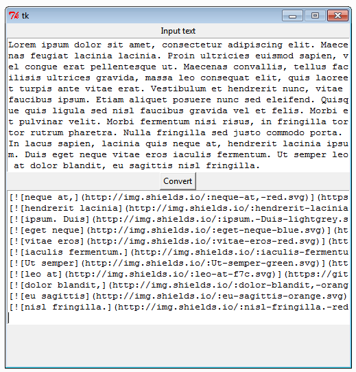

# BogusBadges

How to run: run the .py file in your py2k interpreter of choice, this beauty should appear:

- Paste bogus text on the top text area
- Click "Convert" button
- Copy text that appears on bottom text area
- Paste on your GitHub repo Readme.md
- Profit from the bullshit!!1! This is wall street baby! :trollface:

Example:

